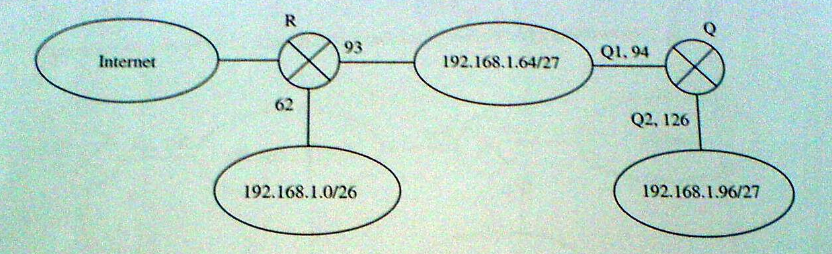

# Kolokwium 1

## Zadanie 1

Wydzielić z sieci klasy C o adresie 192.168.1.0 trzy **jak najmniejsze** podsieci, w taki sposób, aby w pierwszej umieścić 50, w drugiej 30, a w trzeciej 120 komputerów. **Uwaga: podana kolejność nie może być zmieniona!** Dla każdej podsieci należy podać: adres, maskę (w wersji kropkowo-dziesiętnej), adres broadcast i pełny zakres adresów hostów.

## Rozwiązanie

Tworzymy podsieci o rozmiarach 64, 64 oraz 128 adresów.

| Adres sieci   | Maska podsieci  | Broadcast     | Zakres adresów    |
| ------------- | --------------- | ------------- | ----------------- |
| 192.168.1.0   | 255.255.255.192 | 192.168.1.63  | 192.168.1.0-63    |
| 192.168.1.64  | 255.255.255.192 | 192.168.1.127 | 192.168.1.64-127  |
| 192.168.1.128 | 255.255.255.128 | 192.168.1.255 | 192.168.1.128-255 |

## Zadanie 2

Z trzech sieci klasy C o adresach 192.168.4.0, 192.168.5.0 i 192.168.6.0 należy utworzyć dwa bloki adresów w taki sposób, aby w jednym z nich mieścić 250, a w drugim 500 komputerów. Dla każdego bloku należy podać: adres początkowy i maskę (oddzielone ukośnikiem), adres broadcast i pełny zakres adresów hostów.

## Rozwiązanie

Łączymy dwie sieci 192.168.4.0 oraz 192.168.5.0 w jedną sieć o adresie 192.168.4.0/23 - adres sieci ma w części hostowej same zera, mamy 512 adresów obok siebie, zatem mamy sieć IP. Pozostałą sieć 192.168.6.0/24 zostawiamy. 

| Adres początkowy i maska | Adres broadcast | Zakres hostów               |
| ------------------------ | --------------- | --------------------------- |
| 192.168.4.0 / 23         | 192.168.5.255   | 192.168.4.0 - 192.168.5.255 |
| 192.168.6.0 / 24         | 192.168.6.255   | 192.168.6.0 - 192.168.6.255 |

## Zadanie 3

Poniższy rysunek przestawia schemat przykładowego środowiska sieciowego:



Należy tak wpisać odpowiednie wartości w puste pola poniższej tabeli, aby utworzyć tablicę trasowania routera Q.

## Rozwiązanie

| Adres sieci docelowej | Maska           | Adres następnego routera | Fizyczny interfejs wyjściowy |
| --------------------- | --------------- | ------------------------ | ---------------------------- |
| 192.168.1.64          | 255.255.255.224 | 0.0.0.0                  | Q1                           |
| 192.168.1.96          | 255.255.255.224 | 0.0.0.0                  | Q2                           |
| 0.0.0.0               | 0.0.0.0         | 192.168.1.93             | Q1                           |

## Zadanie 4

Rozważmy trzy procesy, każdy działający na innej maszynie. Każda maszyna ma lokalny zegar. Przy założeniu braku korekty czasu, proces P1 wysyła komunikat A w chwili 33. Komunikat ten odbierany jest przez proces P2, w chwili 28. Następnie proces P2 w chwili 32 wysyła komunikat B do procesu P3. Proces P3 odbiera ten komunikat w chwili 38. Wszystkie czasy są podane według zegarów lokalnych. Czasy których maszyn należy skorygować, oraz jakie będą czasy wysłania i odebrania komunikatów po dokonaniu logicznej synchronizacji czasu maszyn zgodnie z algorytmem Lamporta?

## Rozwiązanie

Stan początkowy:

```
P1 wysyła A(33) do P2.
P2 odbiera A(33) w 28.
P2 czeka 4 tyknięcia.
P2 wysyła B(32) do P3.
P3 odbiera B(32) w 38.
```

Korekta czasu:

```
P1 wysyła A(33) do P2.
P2 odbiera A(33) w 28. Następuje korekta czasu P2 do 34.
P2 czeka 4 tyknięcia.
P2 wysyła B(38) do P3.
P3 odbiera B(38) w 38. Następuje korekta czasu P3 do 39.
```

Czasy wysłania i odebrania komunikatów po synchronizacji logicznej:

```
Wiadomość A - wysłana z P1 w 33, odebrana na P2 w 34.
Wiadomość B - wysłana z P2 w 38, odebrana na P3 w 39.
```