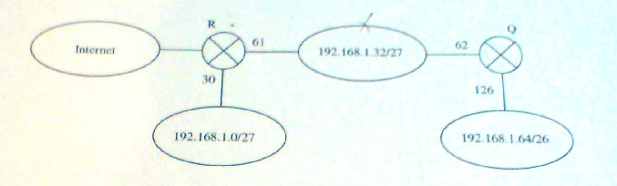

# Kolokwium 2

## Zadanie 1

Poniższy rysunek przedstawia schemat przykładowego środowiska sieciowego.



Jakie **trzy** polecenia należy wydać na hoście znajdującym się w sieci 192.168.1.32/27 aby poprawnie skonfigurować jego interfejs sieciowy oraz tablicę trasowania? Zakładamy że host otrzymuje pierwszy adres z dostępnego zakresu. 

**Wskazówka**: jedno z poleceń konfiguruje interfejs, a pozostałe dwa - tablicę trasowania.

### Rozwiązanie

```bash
# przypisuje własny adres ip hostowi w sieci
ip addr add 192.168.1.33/27 dev eth0

# dodaje trasę do sieci 192.168.1.64/26 przez router 192.168.1.62 do tablicy trasowania
ip route add 192.168.1.64/26 via 192.168.1.62 dev eth0 

# dodaje trasę do internetu oraz do 192.168.1.0/27 (default, 0.0.0.0/0) przez router 192.168.1.61 do tablicy trasowania
ip route add default via 192.168.1.61 dev eth0
```

## Zadanie 2

W sieć, dla której MTU=576 (protokół X25) wysyłany jest komunikat ICMP zawierający 1950 bajtów danych. **Zakłada się, że nagłówek IP ma standardową długość 20 oktetów, a za nagłówkiem IP jest nagłówek ICMP o długości 8 oktetów.** Określić długość i przesunięcie każdego z powstałych fragmentów stosując notację `długość@przesunięcieMF/LF`. Pierwszy fragment przedstawić na rysunku.

### Rozwiązanie

MTU = 576 oznacza, że każdy fragment ma maksymalnie 576 bajtów. Rozmiar nagłówka IP to 20 bajtów, a nagłówek ICMP to 8 bajtów. Dlatego nieprzekraczalna długość pól danych we fragmentach wynosi 576 - 20 = 556 bajtów. Ponieważ 556 nie jest wielokrotnością 8, przyjmowany jest 552. 

Dodatkowo, pierwsze pole danych musi posiadać nagłówek ICMP. Każde kolejne pole danych już go nie potrzebuje - z tego powodu dane wydłużają się o 8 bajtów.

Aby wysłać 1950 bajtów danych, musimy wysłać 4 fragmenty, ponieważ $\lceil (1950+8)/544 \rceil = 4$

Schemat pierwszego fragmentu:

```
N.MTU | N.IP (20 B) | Nagłówek ICMP (8 B) | Dane fragmentu (max 544 B) |
------|-------------|---------------------|-----------...--------------|
      |<----------------------------MTU=576 B---------------------------->|
```

Długości i przesunięcia każdego z powstałych fragmentów:

```
552@0MF
552@552MF
552@1104MF
302@1656LF
```

## Zadanie 3

Rozważmy działanie trzech maszyn w systemie rozproszonym. Maksymalny współczynnik odchylenia zegara pierwszej maszyny: $5\cdot10^{-5}$, drugiej: $10\cdot10^{-5}$, trzeciej: $15\cdot10^{-5}$. Co ile sekund należy synchronizować zegary tych maszyn, aby maksymalne odchylenie między nimi było nie większe niż 60 milisekund? Ile **milisekund** wyniesie maksymalne odchylenie czasu drugiej maszyny między kolejnymi synchronizacjami?

### Rozwiązanie

Algorytm postępowania: bierzemy dwa największe współczynniki i dodajemy je do siebie - otrzymujemy wartość przyrostu odchylenia w ciągu sekundy. W tym wypadku będzie to $25\cdot10^{-5}$. 60 milisekund odchylenia będzie się pojawiać w czasie 240 sekund ($\frac{60\cdot10^{-3}\text{ s}}{25\cdot10^{-5}} = 240$ s).

## Zadanie 4

Utworzyć polecenie systemu Linux wypisujące interfejsy przez które pakiet **opuszcza** routery znajdujące się na trasie do wskazanego komputera i z powrotem? **Podać adresy tych interfejsów**. Z jakiego pola nagłówka IP korzysta to polecenie?

### Rozwiązanie

```bash
# Unix
ping -R xxx.xxx.xxx.xxx
# Windows
ping -r 9 xxx.xxx.xxx.xxx
# pole options
```

## Zadanie 5

Utworzyć polecenie systemu Linux wypisujące interfejsy, przez które pakiet **wpływa** do routerów znajdujących się na trasie do wskazanego komputera. **Podać adresy tych interfejsów**. Z jakiego pola nagłówka IP korzysta to polecenie?

```bash
traceroute xxx.xxx.xxx.xxx
# korzysta z ttl
```