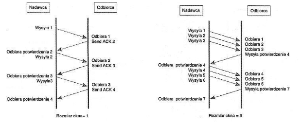
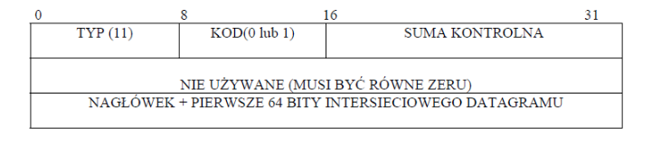

# 1\. Jakie warstwy wystepują w modelu TCP/IP?

- Warstwa aplikacji – zawiera aplikacje do usuwania błędów w sieci, transmisji plików, zdalnego sterowania przepływem i działań internetowych.
- Warstwa transportowa – odpowiada za sterowanie przepływem informacji, sprawdzanie danych oraz potwierdzanie otrzymania danych w sieci. Służy jako interfejs dla aplikacji sieciowych.
- Warstwa internetowa – umożliwia logiczne adresowanie niezależne od sprzętu, co pozwala danym przenosić się między sieciami o różnej strukturze fizycznej. Zapewnia routing redukujący ruch oraz zapewniający dostarczanie przesyłek międzysieciowych. Łączy adresy fizyczne (używane w warstwie interfejsu sieciowego) z adresami logicznymi.
- Warstwa interfejsu sieciowego – zapewnia interfejs z siecią fizyczną. Formatuje dane do transmisji przez nośnik oraz adresuje dane do podsieci, opierając się na adresach fizycznych. Zapewnia sprawdzanie błędów przesyłu w sieci fizycznej.

# 2\. Jakie warstwy modelu OSI odpowiadają warstwie interfejsu sieciowego TCP/IP ?

Warstwie interfejsu sieciowego odpowiadają warstwy: Łącza danych i Warstwa Fizyczna.

# 3\. Jakie warstwy występują w modelu OSI ?

- warstwa fizyczna - umożliwia przesyłanie pojedynczych bitów (są one jednostką usług i jednostką protokołu) między stacjami połączonymi łączem. Dostępne usługi tej warstwy to przesłanie ciągu bitów z zachowaniem ich sekwencji, wykrywanie nieprawidłowości transmisji przez odbiorcę (odrzucenie bitu) i wykrywanie stanów specjalnych łącza. Decydującym czynnikiem określającym parametry transmisji danych jest jakość łącza. Wpływa ona na opóźnienia transmisyjne, szybkość transmisji oraz na liczbę błędów. Warstwa ta szczegółowo określa fizyczne cechy interfejsu sieciowego stacji takie jak: elementy mechaniczne i elektryczne, złącza, poziomy napięć i inne aspekty elektryczne. Znanymi interfejsami łącza fizycznego są np.: RS-232, RS-449\. Warstwa ta określa też cechy funkcjonalne takie jak: założenie, utrzymywanie i zdemontowanie łącza fizycznego;
- warstwa łącza danych - definiuje reguły przesyłania i otrzymywania informacji, zapewnia prawidłową transmisję między stacjami lub węzłami sieci. Umożliwia wykrywanie i korygowanie błędów powstałych w warstwie fizycznej. Jeśli wiele stacji jest połączonych jednym nośnikiem to warstwa ta realizuje funkcję wykrywania stanu łącza oraz bezkolizyjnego dostępu do tego łącza (w wypadku gdyby wiele stacji chciało nadawać jednocześnie). Warstwa ta jest najniższą warstwą, która realizuje transmisję ramek (sekwencje bitów) o określonej strukturze oraz jawnie określonym początku i końcu. Protokoły tej warstwy dobiera się w zależności od jakości łączy. W wypadku gdy łącza są bardzo dobrej jakości pomija się wykrywanie błędów (można to przenieść do wyższych warstw) co daje znaczne przyspieszenie transmisji. W warstwie tej pracują mosty (bridges). Typowe protokoły tej warstwy to HDLC, sterowniki i metody dostępu w sieciach lokalnych (np.: Ethernet, Token Ring), NDIS (Microsoft), ODI (Novell) oraz sieci rozległe z szybką komutacją pakietów (Frame Relay, ATM);
- warstwa sieci - umożliwia utworzenie (przy pomocy węzłów sieci) drogi transmisji między stacjami końcowymi oraz, co się z tym wiąże, wybór drogi lub dróg transmisji (routing). Funkcje tej warstwy umożliwiają unikanie przeciążeń w sieci. Znaczenie jej jest tym większe im więcej jest możliwych dróg przekazywania informacji oraz im bardziej są zróżnicowane charakterystyki poszczególnych fragmentów sieci. W warstwie tej pracują routery. Funkcje tej warstwy odczytują adres docelowy pakietu i kierują go bezpośrednio do stacji w sieci (jeśli adres dotyczy sieci lokalnej) lub przez router do innego segmentu sieci. Typowe protokoły tej warstwy to: IP, X.25, IPX (Novell);
- warstwa transportowa - zapewnia transmisje z wymaganymi charakterystykami, takimi jak: przepustowość, stopa błędów, opóźnienia transmisyjne. Warstwa ta optymalizuje użycie usług sieciowych tak, aby wymagane warunki techniczne spełnić w sposób jak najbardziej ekonomiczny. Warstwa ta „przesłania" usługi oferowane przez niższe warstwy aby ukryć przed wyższymi warstwami szczegóły związane ze znajdującą się niżej siecią. Warstwa ta gwarantuje ponadto dostarczenie danych do odbiorcy oraz realizuje kontrolę błędów i inne operacje związane z niezawodnością transmisji jeśli nie są one realizowane w niższych warstwach (np.: Frame Relay, ATM). Warstwa ta oferuje usługi połączeniowe (ustalane jest łącze przez które pakiety wędrują do miejsca przeznaczenia i docierają tam w kolejności sekwencyjnej) lub bezpołączeniowe. W razie gdy pakiet nie dotrze do odbiorcy lub dojdzie uszkodzony to protokół warstwy transportowej zażąda retransmisji tego pakietu. Typowe protokoły tej warstwy to: TCP, UDP, SPX (Novell), NetBIOS / NetBEUI (Microsoft);
- warstwa sesji - rozszerza funkcje warstwy transportowej o środki umożliwiające synchronizację dialogu i zarządzanie wymianą danych między jej usługobiorcami (aplikacjami). Ustala, który z partnerów ma prawo do nadawania oraz to, czy komunikacja jest naprzemienna, czy równoczesna w obu kierunkach. Warstwa ta umożliwia tworzenie punktów synchronizacji służących do powrotu przez obu uczestników dialogu do takiego punktu w razie wystąpienia nieprawidłowości (np. utrata wysłanych danych w wyniku awarii łącza);
- warstwa prezentacji - w różnych systemach używane są różne postaci informacji, np. kod znaku, typ danych, itd. Warstwa ta zapewnia przekształcenie tych postaci w jednorodną formę sieciową. Przekształcenie to dotyczy składni (syntaktyki) a nie sensu (semantyki) informacji. W warstwie tej następuje również kompresja i szyfrowanie transmitowanych danych. Nadchodzące dane są zamieniane na postać, którą można przedstawić użytkownikowi (na ekranie lub wydruku);
- warstwa aplikacji - oferuje całość usług komunikacyjnych procesom użytkowników. Dostępne są funkcje takie jak: ustalenie protokołu transmisji, zawieszanie i wznawianie połączenia, dotyczące synchronizacji działań i stwierdzanie autentyczności partnerów. Typowymi usługami tej warstwy są również: transfer plików i działanie zdalne na plikach, dostęp i działanie na zdalnych bazach danych, praca procesu użytkowego jako terminala zdalnego komputera, poczta elektroniczna i inne;

# 4\. Jaka jest zasadnicza różnica między UDP i TCP ?

UDP jest protokołem bezpołączeniowym, a TCP połączeniowym. W metodzie bezpołączeniowej system sieciowy odpowiada jedynie za przesłanie pakietów. Wykrywanie błędów i sterowanie przepływem realizowane jest przez nadawcę i odbiorcę. W przypadku, gdy zostanie wykryty fakt, że pakiet nie dotarł do odbiorcy to musi on wysłać żądanie retransmisji w celu otrzymania pakietu. Brak pakietu wykrywany jest podczas składania z nadesłanych pakietów pierwotnej informacji.

W metodzie połączeniowej system sieciowy przejmuje odpowiedzialność za bezbłędne dostarczenie pakietów we właściwej kolejności i wykrywanie zagubionych lub uszkodzonych pakietów. Przed przesyłaniem danych między nadawcą i odbiorcą ustanawiany jest kanał komunikacyjny (kanał logiczny, połączenie wirtualne). Kanał ten stanowi ustalony tor, po którym pakiety mogą być przesyłane w sposób uporządkowany. Kanał określony jest przez stacje końcowe, tzn. ważne jest utrzymywanie kontaktu między stacjami, nie zaś rzeczywisty fizyczny tor w sieci.

# 5\. W jaki sposób zachodzi proces zakończenia połączenia za pomocą TCP?

Ponieważ połączenie TCP jest połączeniem full-duplex, to każdy z kierunków musi zostać zamknięty niezależnie. Zasadą jest, że jeden z końców wysyła pakiet FIN po zakończeniu przesyłania danych. Kiedy stacja odbierze segment FIN, musi powiadomić aplikację, że druga strona połączenia zakończyła ten kierunek przepływu danych. Odebranie FIN oznacza jedynie, że w tym kierunku połączenia nie będą płynęły już dane. TCP może nadal wysyłać dane po odebraniu FIN (połączenie półzamknięte). W celu pełnego zamknięcia połączenia druga strona musi wykonać podobną sekwencję operacji (FIN, oraz potwierdzenie ACK FIN).

# 6\. W jaki sposób dokonuje się transmisji danych za pomocą TCP?

TCP opiera się na mechanizmie pozytywnych potwierdzeń. Wysłane pakiety muszą zostać potwierdzone przed upływem maksymalnego czasu oczekiwania na potwierdzenie albo zostają wysłane ponownie. W celu zwiększenia szybkości transmisji stosowany jest mechanizm przesuwnych okien. Nadawca i odbiorca ustalają ze sobą szerokośćokna. Okno jest to maksymalna ilość pakietów jaką można wysłać bez potwierdzenia. Następne datagramy są wysyłane dopiero po potwierdzeniu poprzednich. Odbiorca wysyła potwierdzenie otrzymania z numerem pakietu, którego oczekuje. Odpowiedzi mają ustawioną flagę ACK w pakiecie TCP.



# 7\. Suma kontrolna w nagłówkach protokołów IP i TCP

Pole suma kontrolna jest 16 - bitowym jedynkowym uzupełnieniem jedynkowo uzupełnionej sumy wszystkich 16 - bitowych słów w segmencie. Ta suma obejmuje zarówno nagłówek jak i dane segmentu.

# 8\. Co to jest CRC i gdzie jest stosowane?

cykliczną sumą kontrolną (CRC - Cyclic Redundancy Check). W metodzie tej elementy transmitowanego ciągu traktuje się jako współczynniki kolejnych wyrazów wielomianu W(x) stopnia m-1\. Na słowo kodowe składa się ciąg wejściowy oraz r bitów nadmiarowych, stanowiących współczynniki wielomianu będącego resztą z dzielenia modulo 2 wielomianu W(x) przez tzw. wielomian generacyjny G(x) stopnia r. Odbiorca dokonuje dzielenia odebranego słowa kodowego przez ten sam wielomian generacyjny, a kryterium poprawności transmisji jest reszta z dzielenia równa 0\. Ciąg r bitów nadmiarowych nazywa się wartością CRC. Skuteczność tej metody zależy w decydującej mierze od doboru stopnia i postaci wielomianu generacyjnego. Prawidłowo dobrany wielomian G(x) zapewnia wykrycie wszystkich występujących w słowie kodowym błędów: pojedynczych, podwójnych (dwóch izolowanych błędów pojedynczych), błędów polegających na przekłamaniu nieparzystej liczby bitów oraz wszystkich błędów seryjnych o długości serii mniejszej lub równej r. Stosowana jest w... (niedokończone)

# 9\. Pole identyfikacja w nagłówku IP

Pole identyfikacja (16 bitów) jest używane do jednoznacznego oznaczenia każdego fragmentu pierwotnego datagramu. Identyfikator zamieszczony w tym polu jest powtarzany we wszystkich fragmentach składających się na pierwotny datagram.

# 10\. Pole flagi w nagłówku IP.

Pole flagi zawiera 3 bity. (pierwszy - zawsze zero, drugi określa czy można (1) czy nie można (0) fragmentować datagram, trzeci - identyfikacja ostatniego fragmentu składającego się na pierwotny datagram (wartość 0 określa ostatni, 1 oznacza kolejny fragment)).

# 23\. Co oznacza 0.0.0.0 lub _._._._ w tabeli routingu?

```
Oznacza to, że docelowa sieć jest bezpośrednio przyłączona do komputera i, że „bramą” do
tej sieci jest interfejs sieciowy komputera.
```

# 24\. Co oznacza flaga PUSH w TCP?

```
Flaga PUSH wymusza jak najszybsze wysłanie dalej pakietu przez odbiorcę. Znacznik ten jest
uwagą przekazywaną odbiorcy aby przekazał odebrane dane aplikacji, przekazane dane mają
zawierać wszystko, co znajduje się w segmencie
ze znacznikiem PUSH a także inne dane znajdujące się w kolejce. W oryginalnej specyfikacji
TCP założono, że interfejs programowy będzie pozwalał procesowi wysyłającemu na
przekazanie TCP informacji o tym, kiedy należy ustawić znacznik PUSH, można przez to
zawiadomić klienta, że proces nie chce przechowywać danych w buforze wyjściowym w
oczekiwaniu na nadejście kolejnych danych. Znacznika tego używa się najczęściej przy
przesyłaniu danych interaktywnych.
```

# 25\. Co to jest domena wyszukiwania odwrotnego?

```
Domena ta zajmuje się tłumaczeniem adresów IP na nazwy domenowe.
```

# 26\. Co to są „root-servers"?

```
Na najwyższym poziomie systemu DNS znajdują się główne serwery nazw (root level
servers), podłączone do dużych i szybkich sieci szkieletowych Internetu. Przechowują adresy
serwerów nazw dla domen najwyższego poziomu (a więc .com, .edu, .org, itp. oraz domen
krajowych) a ich adresy muszą być znane każdemu innemu serwerowi nazw.
```

# 27\. Jakiego protokołu transportowego używa DNS?

```
DNS używa celu protokołu UDP a więc bezpołączeniowego.
```

# 28\. W jaki sposób blokuje się usługi za pomocą pliku inetd.conf?

````
Robimy to wstawiając znak komentarza (#) na początku lini, w której znajduje się linia
dotycząca interesującej nas usługi. Plik, w którym musimy to zrobić nazywa się inetd.conf.
Np. linię:
```
netbios-ns dgram udp wait root /usr/local/samba/bin/nmbd nmbd
```
wykomentujemy w ten sposób:
```
#netbios-ns dgram udp wait root /usr/local/samba/bin/nmbd nmbd
```
````

# 29\. Co to jest port w protokołach warstwy transportowej?

```
Umożliwia wielu działającym na jednej maszynie programom użytkowanym jednoczesne
komunikowanie się oraz rozdziela między programy użytkowe przybywające pakiety TCP.
UDP podobnie jak i TCP używa numerów portów protokołu do identyfikacji w ramach
maszyny końcowego odbiorcy. Każdy z tych portów ma przypisaną małą liczbę całkowitą,
która jest używana do jego identyfikacji. W przychodzącym datagramie IP znajduje się
informacja na temat protokołu, która obok numeru portu jest używana przy identyfikacji.
```

# 30\. Mechanizm multipleksacji

```
Dane z sieci docierają do komputera w postaci jednego strumienia. Strumień ten może
zawierać pakiety danych pochodzące z wielu źródeł i mogą one być przeznaczone dla różnych
aplikacji. Taki strumień nazywamy zmultipleksowanym, aby dane zostały dostarczone do
właściwych aplikacji taki strumień musi zostać zdemultipleksowany.
```

# 1\. Maska IP, czym jest i do czego jest używana?

```
Maska podsieci, maska adresu (ang. subnetwork mask, address mask) – liczba służąca do
wyodrębnienia w adresie IP części sieciowej od części hosta.
Po wykonaniu iloczynu bitowego maski i adresu IP komputera otrzymujemy adres IP całej
sieci, do której należy ten komputer.
Maska adresu jest liczbą o długości adresu (32 bity dla IPv4 lub 128 bitów dla IPv6),
składającą się z ciągu bitów o wartości 1, po których następuje ciąg zer. Wartość maski musi
być znana wszystkim routerom i komputerom znajdującym się w danej podsieci. W wyniku
porównywania maski adresu (np. 255.255.255.0) z konkretnym adresem IP (np. 192.180.5.22)
router otrzymuje informację o tym, która część identyfikuje podsieć (w tym przypadku
192.180.5), a która dane urządzenie (.22). Często można spotkać się ze skróconym zapisem
maski, polegającym na podaniu liczby bitów mających wartość 1.
```

# 2\. Co to jest adres IP broadcastu?

```
Adres IP zawierający w części hostowej same zera jest adresem całej sieci, natomiast adres
zawierający same jedynki
jest tzw. adresem broadcast. Służy on do adresowania informacji przeznaczonej dla
wszystkich hostów w danej sieci, a nie tylko dla jednego z nich.
W sieci lokalnej Ethernet w warstwie łącza danych rozgłoszeniowy jest adres MAC którego
wszystkie bity mają wartości 1 (FF:FF:FF:FF:FF:FF).
Jest on przeważnie wykorzystywany w protokole ARP (Address Resolution Protocol) do
przekształcania adresów sieciowych (np. adresów IP) na adresy ethernetowe (MAC).
Załóżmy, że adres IP to 212.51.219.32, co w przeliczeniu na system binarny daje nam:
11010100.00110011.11011011.00100000,
zaś maska podsieci to 255.255.255.192, binarnie: 11111111.11111111.11111111.11000000.
oznacza to, że mamy 26 bitów sieci (26 jedynek) i 6 bitów hosta.
Cała operacja sprowadza się do wstawienia w adres IP jedynek na ostatnich n pozycjach, na
których w masce znajdują się zera, gdzie n oznacza liczbę bitów hosta. W tym przypadku 6
11010100.00110011.11011011.00100000 adresIP
11111111.11111111.11111111.11000000 maska
11010100.00110011.11011011.00111111 broadcast
Używając logicznych wyrażeń bitowych operację tę możemy zapisać jako:
broadcast = adresIP & (! maska)
Zatem adres broadcast to 11010100.00110011.11011011.00111111, co w przeliczeniu na
system dziesiętny daje 212.51.219.63.
```

# 3\. Protokół IP do czego służy i w jakiej warstwie funkcjonuje?

```
jest to protokół transportowy sieci Internet.
protokół komunikacyjny warstwy sieciowej modelu OSI (warstwy internet w modelu
TCP/IP). Używany powszechnie w Internecie i sieciach lokalnych.
Służy do:
- a) definiowanie datagramu (podstawowej jednostki przesyłania danych), czyli określenie
dokładanego formatu wszystkich przesyłanych danych,
- a) definiowanie schematu adresowania używanego w całym Internecie,
- a) trasowanie (rutowanie) datagramów skierowanych do odległych hostów, czyli
wybieranie trasy którą będą przesyłane dane,
- a) dokonywanie fragmentacji i ponownej defragmentacji datagramów.
Protokół IP jest protokołem zawodnym – nie gwarantuje, że pakiety dotrą do adresata, nie
zostaną pofragmentowane, czy też zdublowane, a ponadto mogą dotrzeć do odbiorcy w innej
kolejności niż zostały nadane. Niezawodność transmisji danych jest zapewniana przez
protokoły warstw wyższych (np. TCP), znajdujących się w hierarchii powyżej warstwy
sieciowej.
```

# 4\. Metoda CSMA/CD na czym polega?

```
Carrier Sense Multiple Access with Collision Detect (CSM/CD) oznacza, że wiele
komputerów może korzystać z łącza, a każda maszyna sprawdza czy eter jest wolny. Polega
to na tym, że zanim urządzenie działające w sieci (np. karta sieciowa) rozpocznie wysyłanie
danych, sprawdza czy aktualnie jakieś inne urządzenie nie transmituje danych. Jeśli medium
transmisji jest wolne urządzenie rozpoczyna transmisję równocześnie nasłuchując czy jakieś
inne urządzenie nie rozpoczęło transmisji w tym samym czasie (sytuacja taka nazywana jest
kolizją). Jeśli nastąpi kolizja, oba komputery czekają losowy kwant czasu nim zaczną
ponownie nadawać.
```

# 5\. Protokół ARP, do czego jest używany i jak funkcjonuje?

```
protokół sieciowy umożliwiający konwersję logicznych adresów warstwy sieciowej na
fizyczne adresy warstwy łącza danych. Protokół ten nie ogranicza się tylko do konwersji
adresów IP na adres MAC stosowany w sieciach Ethernet,
Protokół ARP nie jest niezbędny do działania sieci komputerowych, może zostać zastąpiony
przez statyczne wpisy w tablicy ARP, przyporządkowujące adresom warstwy sieciowej
adresy fizyczne na stałe.
ARP działa w następujący sposób[1] :
1\. w celu ustalenia adresu fizycznego hosta docelowego wysyłane jest żądanie ARP
request do wszystkich hostów znajdujących się w tej samej sieci. Zapytanie zawiera
adres logiczny hosta docelowego oraz adres fizyczny hosta wysyłającego zapytanie
2\. na zapytanie odpowiada tylko ten host, którego adres logiczny jest identyczny z
adresem logicznym umieszczonym w zapytaniu. Odpowiedź zawiera adres logiczny i
fizyczny hosta docelowego.
3\. Odebrany adres fizyczny zapisywany jest w tablicy ARP i parowany z adresem
logicznym hosta docelowego, dzięki czemu nie będzie wymagane ponowne
odkrywanie adresu fizycznego do momentu wyczyszczenia tablicy
Często po podłączeniu do sieci host rozsyła zapytanie ARP o własny adres. Ma to na celu
dwie rzeczy, po pierwsze: ustalenie czy w sieci jest już podpięty system dysponującym
identycznym adresem. Po drugie: każdy host obecny w danej sieci może zapisać w pamięci
podręcznej dane o nowym hoście przyłączonym do sieci.
```

# 6\. Dostarczanie bezpośrednie i pośrednie datagramów IP

```
???????
a) komputer docelowy znajduje się w lokalnej sieci - dane są dostarczane bezpośrednio do niego;
b) komputer docelowy znajduje się w innej sieci - dane są dostarczane do lokalnego gateway'a.
```

# 7\. Czy ramka jest zawarta (kapsułkowana) w datagramie?

# 8\. Protokół ICMP do czego jest używany?

```
internetowy protokół komunikatów kontrolnych) – opisany w RFC 792 protokół warstwy
sieciowej OSI/TCP/IP wykorzystywany w diagnostyce sieci oraz trasowaniu. Pełni przede
wszystkim funkcję kontroli transmisji w sieci. Jest wykorzystywany w programach ping oraz
traceroute.
Teoretycznie sieci powinny działać poprawnie przez cały czas, lecz tak nie jest. Gdy coś
dzieje się nie tak w warstwie internetowej, role narzędzia do rozwiązywania problemów
odgrywa protokół komunikacyjny zarządzania siecią Internet (ICMP — Internet Control
Message Protocol). ICMP jest protokołem serwisowym, który zgłasza błędy łączności między
hostami.
W warstwie internetowej datagramy dostarczane są w sposób bezpołączeniowy. Protokół
ICMP jest zestawem komunikatów, przesyłanych w datagramach IP i zdolnych do zgłaszania
błędów w dostarczaniu innych datagramów IP.
```

# 9\. Z czego się składa tabela routingu IP?

```
Każdy komputer, na którym uruchomiony jest protokół TCP/IP, podejmuje decyzje dotyczące
routingu na podstawie tabeli routingu IP.
- Miejsce docelowe
Miejsce docelowe jest docelowym hostem, adresem podsieci, adresem sieci lub trasą
domyślną. Miejscem docelowym trasy domyślnej jest 0.0.0.0.
- Maska sieci
Maska sieci w połączeniu z miejscem docelowym pozwala określić, kiedy jakaś trasa jest
używana. Na przykład trasa hosta ma maskę 255.255.255.255, trasa domyślna ma maskę
0.0.0.0, a trasa podsieci lub sieci ma jakąś maskę między tymi ekstremami.
Maska 255.255.255.255 oznacza, że dana trasa jest używana tylko dla dokładnych
odpowiedników miejsca docelowego. Maska 0.0.0.0 oznacza, że dana trasa może zostać użyta
dla dowolnego miejsca docelowego. Gdy maska jest zapisana w formie binarnej, bit 1 jest
znaczący (musi pasować), a bit 0 nie jest znaczący (nie musi pasować).
Przypuśćmy na przykład, że miejsce docelowe o adresie 172.16.8.0 ma maskę sieci
255.255.248.0\. Ta maska sieci oznacza, że dwa pierwsze oktety muszą pasować w całości,
pierwsze pięć bitów trzeciego oktetu musi pasować (248=11111000), a ostatni oktet nie ma
znaczenia. Trzeci oktet adresu 172.16.8.0 (czyli 8) w układzie binarnym równa się 00001000.
Bez zmiany pierwszych pięciu bitów (część pokazana jako pogrubiona) można dojść do
wartości 15, czyli binarnie do wartości 00001111\. Zatem trasa o miejscu docelowym
172.16.8.0 z maską 255.255.248.0 dotyczy wszystkich pakietów o miejscu docelowym od
172.16.8.0 do 172.16.15.255.
- Brama
Brama jest adresem IP następnego routera, do którego pakiety muszą zostać wysłane. Dla
łącza sieci LAN (takiego jak Ethernet lub token ring) brama musi być bezpośrednio osiągalna
przez dany router przy użyciu interfejsu wskazanego w kolumnie Interfejs. Dla łącza LAN
brama i interfejs określają, jak dane są przesyłane dalej przez dany router. W przypadku
interfejsu wybierania numerów na żądanie bramy nie konfiguruje się. W przypadku łącza typu
„punkt z punktem” sam interfejs określa, jak dane są przesyłane dalej przez dany router.
- Interfejs
Interfejs wskazuje interfejs sieci LAN lub interfejs wybierania numerów na żądanie, który ma
zostać użyty, aby osiągnąć następny router
```

# 9\. Do czego jest używana brama (gatawey)?

```
maszyna podłączona do sieci komputerowej, za pośrednictwem której komputery z sieci
lokalnej komunikują się z komputerami w innych sieciach.
W sieci TCP/IP domyślna brama (sieciowa) (ang. default gateway) oznacza router, do
którego komputery sieci lokalnej mają wysyłać pakiety o ile nie powinny być one kierowane
w sieć lokalną lub do innych, znanych im routerów. W typowej konfiguracji sieci lokalnej
TCP/IP wszystkie komputery korzystają z jednej domyślnej bramy, która zapewnia im
łączność z innymi podsieciami lub z Internetem.
Maszyna bez podanego adresu bramy domyślnej może wymieniać pakiety tylko z
komputerami w tej samej sieci lokalnej.
- Brama może również odbierać adresowane do siebie pakiety wybranych protokołów i
interpretować je na poziomie aplikacji – zwykle określa się ją wtedy jako serwer
pośredniczący.
- Niektóre bramy zapewniają również przeniesienie pakietu z sieci o jednym protokole do
sieci o innym protokole. Tak działają bramy przenoszące pakiety z sieci IPv4 do sieci IPv6
```

# 11\. Co to jest trasa domyślna w tabeli routingu ?

```
trasa domyślna jest używana, gdy w tabeli routingu nie zostaną znalezione inne trasy. Jeśli na
przykład router lub host nie może znaleźć trasy sieciowej lub trasy hosta dla miejsca
docelowego, używana jest trasa domyślna. Trasa domyślna upraszcza konfigurację hostów.
Zamiast konfigurować hosty przy użyciu tras dla wszystkich identyfikatorów sieci w
intersieci, pojedyncza trasa domyślna używana jest do przekazywania wszystkich pakietów z
siecią docelową lub docelowym adresem w intersieci, które nie zostaną znalezione w tabeli
routingu.
```

# 10\. Na podstawie czego jest wyznaczana trasa datagramy IP?

# 13\. Pole identyfikacja w nagłówku datagramu IP

```
`[16-bitowe]` - zawiera wartość identyfikacyjną przypisaną nadawanemu pakietowi przed
fragmentacją (jeżeli miałaby ona miejsce). W przypadku fragmentacji określa ona
przynależność fragmentu do datagramu.
```

# 14\. Pole offset w nagłówku datagramu IP. Podaj przykład.

```
To pole okresla, gdzie w oryginalnym pakiecie powinien byc umieszczony dany fragment.
Jednostka tutaj jest 8 bajtow (64 bity). Pierwszy fragment ma wartosc ofsetu zero.
```

# 15\. Z czego obliczana jest suma kontrolna w nagłówku IP i nagłówku TCP?

```
pozwala wykryć uszkodzenia nagłówka pakietu, które nastąpiły w wyniku błędów transmisji.
Jest wyliczana z pól nagłówka
```

# 16\. Komunikat ICMP „prośba o echo"

```
ICMP Echo Request jest komunikatem protokołu ICMP, który zawiera pakiet danych do
hosta oraz żądanie ich odesłania jako ICMP Echo Reply. Host musi odpowiedzieć na każde
żądanie echa komunikatem ICMP Echo Reply zawierającym dokładnie te same dane co
odebrany pakiet ICMP Echo Request. ICMP Echo Request jest stosowany do diagnostyki
sieci, może też posłużyć do ataków takich jak Ping of death lub Ping flood.
```

# 17\. Komunikat ICMP „czas przekroczony"

```
Przekroczenie terminu komunikat wysyłany przy porzuceniu datagramu z powodu
przekroczenia czasu życia datagramu
Routery intersieci obliczają adres następnego etapu przy użyciu własnych tablic. Błędy w tych
tablicach mogą spowodować pętle w trasowaniu do jakiegoś odbiorcy D. Pętle występują gdy
router, zamiast kierować datagramy do D kierują je do siebie nawzajem. Datagram, który wszedł
do pętli w trasowaniu, porusza się po niej w nieskończoność. Aby temu zapobiec każdy datagram
IP zawiera licznik czasu życia, jest to pole o długości 13 bitów, które wskazuje w sekundach czas,
przez jaki datagram pozostanie w sieci zanim zostanie odrzucony. Ilekroć dany datagram
przechodzi przez router czas istnienia (TTL) zostaje zmniejszony o co najmniej jedną sekundę.
Ponieważ router normalnie przekazuje schemat IP w czasie krótszym niż jedna sekunda,
ustawienie (TTL) staje się liczbą przeskoków (etapów).
„Gdy router porzuca datagram w wyniku wyczerpania się licznika etapów albo z powodu
przekroczenia czasu oczekiwania na jego fragmenty, wysyła do nadawcy komunikat ICMP
`<przekroczenie czasu>”[1]` o formacie przedstawionym na rys. 8


```

# 18\. Czy składanie fragmentów datagramów IP może zachodzić w

węzłach pośrednich?

# 19\. Jak następuje nawiązywanie połączenia za pomocą protokołu

TCP?

```
Ustanowienie połączenia odbywa się w następujących etapach :
-nadawczy moduł TCP wysyła do odbiorczego modułu TCP segment z bitem SYN=1 i z
proponowanym numerem INS w polu numer sekwencyjny,
-odbiorczy moduł TCP, jeśli zgadza się na ustanowienie połączenia, to przesyła zwrotnie segment z
bitami SYN=1 i ACK=1, a w polu numer sekwencyjny podaje numer INS, z którym rozpocznie
działanie
-nadawczy moduł TCP wysyła segment z potwierdzeniem otrzymania zgody (ACK=1) na
ustanowienie połączenia i równocześnie zawierający dane.
W ten sposób zostaje ustanowione połączenie wirtualne między dwoma modułami TCP i mogą
zostać przesyłane segmenty z danymi. Segmenty te mogą być przesyłane tym połączeniem w obu
kierunkach, ponieważ TCP umożliwia transfer danych między dwoma modułami w trybie
dupleksowym.


```

# 20\. Jak się realizuje niezawodność przesyłania danych przy pomocy

protokołu TCP?

```
Dla zapewnienia niezawodnej transmisji TCP wykorzystuje sekwencyjną numerację bajtów oraz
mechanizm pozytywnych potwierdzeń z retransmisją. Numer sekwencyjny przypisany do każdego
przesyłanego bajtu danych pozwala na jego jednoznaczną identyfikację, a także jest używany w
mechanizmie przesyłania potwierdzeń. Ponieważ kolejne bajty są numerowane począwszy od INS, a
zatem numer pierwszego bajtu wysłanego w połączeniu wirtualnym wynosi INS+1 ( zazwyczaj
INS=0).
Nadawczy moduł TCP dokonuje retransmisji danych do czasu, aż otrzyma potwierdzenie
poprawnego ich przyjęcia przez odbiorczy moduł TCP. Rozpoczęcie retransmisji uwarunkowane jest
przekroczeniem wcześniej ustalonego czasu oczekiwania na nadejście potwierdzenia.
Po stronie odbiorczej poprawność odbioru danych sprawdzana jest przy użyciu pola suma kontrolna
znajdującego się w nagłówku segmentu. Jeżeli dane są akceptowane to moduł TCP wysyła zwrotnie
pozytywne potwierdzenie. Jest ono zawarte w polu numer potwierdzenia. Wszystkie bajty danych o
numerach sekwencyjnych mniejszych od wartości zawarte w tym polu zostały odebrane poprawnie.
W sytuacji, gdy dane zostały odebrane poprawnie, a nadawczy moduł TCP retransmitował je
np. z powodu zaginięcia segmentu z pozytywnym potwierdzeniem, odbiorczy moduł TCP ma
możliwość odrzucenia nadmiarowych danych (duplikatów).
```
