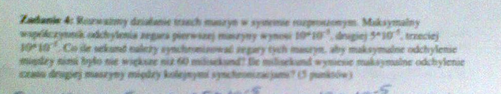

# Kolokwium 2

## Zadanie 1

Poniższy rysunek przedstawia schemat przykładowego środowiska sieciowego.


Jakie **trzy** polecenia należy wydać na hoście znajdującym się w sieci 192.168.1.32/27 aby poprawnie skonfigurować jego interfejs sieciowy oraz tablicę trasowania? Zakładamy że host otrzymuje pierwszy adres z dostępnego zakresu.

**Wskazówka**: jedno z poleceń konfiguruje interfejs, a pozostałe dwa - tablicę trasowania.

### Rozwiązanie

```bash
# konfiguracja interfejsu sieciowego dla komputera - 192.168.1.33/27
ip addr add 192.168.1.33/27 dev eth0
# konfiguracja trasy przez router Q
ip route add 192.168.1.64/26 via 192.168.1.62 dev eth0
# konfiguracji trasy przez router R
ip route add 0.0.0.0/0 via 192.168.1.61 dev eth0
```

## Zadanie 2


```bash
# konfiguracja interfejsu sieciowego dla hosta 192.168.1.129
ip addr add 192.168.1.129/27 dev eth0
# konfiguracja trasy przez router R
ip route add 192.168.1.0/25 via 192.168.1.157 dev eth0
# konfiguracja trasy przez router Q
ip route add 0.0.0.0/0 via 192.168.1.158 dev eth0
```

## Zadanie 3

W sieć, dla której MTU=576 (protokół X25) wysyłany jest komunikat ICMP zawierający 1950 bajtów danych. **Zakłada się, że nagłówek IP ma standardową długość 20 oktetów, a za nagłówkiem IP jest nagłówek ICMP o długości 8 oktetów.** Określić długość i przesunięcie każdego z powstałych fragmentów stosując notację `długość@przesunięcieMF/LF`. Pierwszy fragment przedstawić na rysunku.

1950 bajtów danych

MTU 576 -> 556

552 bajtów danych

1958 bajtów danych

Cały pakiet:

nagłówek IP | nagłówek ICMP | dane
----------- | ------------- | ----------
20 bajtów   | 8 bajtów      | 1950 bajtów

Pierwszy fragment:

nagłówek IP | nagłówek ICMP | dane
----------- | ------------- | ----------
20 bajtów   | 8 bajtów      | 544 bajtów

Pierwszy fragment: IP + nagłówek + reszta danych zaokrąglając do 8 bajtów

| 20 bajtów nagłówka IP | 8 bajtów nagłówka ICMP | 544 bajtów danych |

Drugi fragment:

| 20 bajtów nagłówka IP | 552 bajtów danych |

Trzeci fragment:

| 20 bajtów nagłówka IP | 552 bajtów danych |

Czwarty fragment:

| 20 bajtów nagłówka IP | 302 bajty danych | KONIEC


```
1. 552@0MF
2. 552@552MF
3. 552@1104MF
4. 302@1656LF
```

## Zadanie 4


MTU=296 PPP

900 bajtów danych

header IP: 20 bajtów
ICMP: 8 oktetów


296 - 20 = 276

272 bajtów danych

4 pakiety

| 20 bajtów nagłówka ip | 272 bajtów danych | 

```
1. 272@0MF
2. 272@272MF
3. 272@544MF
4. 92@816LF
```


## Zadanie 3

Rozważmy działanie trzech maszyn w systemie rozproszonym. Maksymalny współczynnik odchylenia zegara pierwszej maszyny: $5\cdot10^{-5}$, drugiej: $10\cdot10^{-5}$, trzeciej: $15\cdot10^{-5}$. Co ile sekund należy synchronizować zegary tych maszyn, aby maksymalne odchylenie między nimi było nie większe niż 60 milisekund? Ile **milisekund** wyniesie maksymalne odchylenie czasu drugiej maszyny między kolejnymi synchronizacjami?

```
25*10-5

60 ms / (25*10-5) = 60*10-3 / (25*10-5) = 240 s

NIE RZADZIEJ NIŻ 240 S NALEŻY SYNCHRONIZOWAĆ MASZYNY

240 s * 10 * 10-5 = 24 ms
```

## Zadanie 4



10*10-5
5*10-5
10*10-5

60 ms

drugiej

20*10-5

60 *10-3 / (20*10-5) = 3 * 100 = 300 s

nie rzedziej niż co 300 sekund

300 s * 5* 10-5 = 15 ms


## Zadanie 4

Utworzyć polecenie systemu Linux wypisujące interfejsy przez które pakiet **opuszcza** routery znajdujące się na trasie do wskazanego komputera i z powrotem? **Podać adresy tych interfejsów**. Z jakiego pola nagłówka IP korzysta to polecenie?

```
ping -R
(na windowsie ping -r 9)
pole options

213.135.44.33
213.135.44.133
195.149.232.32
162.158.100.1
1.1.1.1
1.1.1.1
162.158.100.1
213.135.44.130
213.135.44.62

```

## Zadanie 5

Utworzyć polecenie systemu Linux wypisujące interfejsy, przez które pakiet **wpływa** do routerów znajdujących się na trasie do wskazanego komputera. **Podać adresy tych interfejsów**. Z jakiego pola nagłówka IP korzysta to polecenie?

```
traceroute xxx.xxx.xxx.xxx
korzysta z ttl

 1  _gateway (213.135.44.62)  0.138 ms  0.097 ms  0.110 ms
 2  lapocalypse-des-animaux.wsisiz.edu.pl (213.135.44.136)  0.296 ms  0.324 ms  0.303 ms
 3  agora.tpix.pl (195.149.232.33)  1.169 ms  1.252 ms  1.130 ms
 4  host-193-42-228-134.gazeta.pl (193.42.228.134)  1.902 ms  2.268 ms  1.677 ms
 5  host-80-252-0-145.gazeta.pl (80.252.0.145)  1.060 ms  1.039 ms  1.076 ms
```

DNS usługa wartstwy 7, domain name serwer, 53 port


## Zadanie

Obliczyć efektywną przepustowość segmentu sieci Ethernet o przepustowości nominalnej 
100 Mb/s, jeśli przesyłane są w nim ramki o długości pola danych równej 500 B? 

100 000 000 / 500 = 