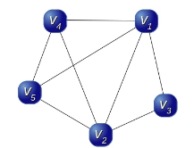
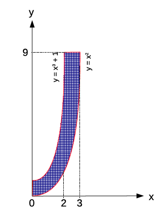

# ASD 2

## Egzamin

**Nazwisko i imię:** Igor Nowicki
**Grupa:** IZ06IO1
**WSISiZ**

### Zadanie 0.

Weryfikacja ćwiczeń.

Proszę oszacować złożoność, ze względu na liczbę wywołań funkcji,
algorytmu opisanego funkcją rekurencyjną:

void Fun(int n){
if(n>0){
Fun(n-1);
Fun(n-1);
}
}

Rozwiązanie: O(2n)

## Zadania 0 - 55 p.

### Zadanie 1. 45 p.

Proszę zbudować drzewo kodowe Huffmana dla tekstu:

ANNA MA MANKO

Proszę podać kody oraz zakodować powyższy tekst.

### Zadanie 2. 25 p.

Proszę oszacować złożoność, ze względu na liczbę inkrementacji, poniższego algorytmu:

```
for(int i = 0; i< n; ++i){
int f = rand()%3;
if(f>0)
for(int j = 0; j< n; ++j);
}
```

### Zadanie 3. 25 p.

Proszę określić która złożoność i dla jakiego n jest większa: `22n` czy `n!`

Odpowiedź proszę uzasadnić.

## Zadania 56 - 75 p.

### Zadanie 4. 15 p.

Mamy graf:



Proszę zaproponować metodę oszacowania i oszacować rozmiar maksymalnej kliki w tym grafie.

### Zadanie 5. 30 p.

Mamy graf:


Proszę, korzystając z algorytmu backtrackingowego - leksykograficznego wyznaczyć maksymalną klikę w tym grafie.

## Zadania 76 - 100 p.

### Zadanie 6. 15 p.

Proszę zaproponować i udowodnić cechę podzielności przez 7.

#### Rozwiązanie

Liczba jest podzielna przez 7, jeśli kolejne cyfry w reprezentacji dziesiętnej, mnożone przez kolejne potęgi 3 (zaczynając od $3^0 = 1$) sumują się do liczby podzielnej przez 7.

Dowód: Dla liczby jednocyfrowej relacja jest oczywiście spełniona, ponieważ $n\cdot3^0$ jest podzielna przez 7 jeśli n jest podzielna przez 7.

Dla liczby dwucyfrowej - możemy reprezentować $n$ jako $10x+y$, gdzie $x,y$ są liczbami całkowitymi z zakresu od 0 do 9. Zsumowane cyfry według instrukcji dają nam $3^1x + 3^0y = 3x+y$. Jeśli $7|3x+y$, to $10x + y \mod 7 = (3x + y) + 7x \mod 7 = 7x \mod 7 = 0$. W drugą stronę, jeśli $10x + y\mod 7 = 0$, to również $3x + y\mod 7 = 0$, ponieważ zawsze możemy odjąć $7x$ w operacji $\mod 7$.

Dla liczby $k$-cyfrowej $n_k = 10^0a_0 + 10^1a_1 + \dots + 10^{k-1}a_{k-1}$, gdzie $a_i \in [0,9]$. Odpowiadająca jej liczba powstała przez sumę cyfr przemnożonych przez kolejne potęgi 3 to $m_k = 3^0a_0 + 3^1a_1 + \dots + 3^{k-1}a_{k-1}$.

Chcemy udowodnić, że $m_k\mod 7 = 0 \iff n_k\mod 7 = 0$.

Niech $m_k\mod 7 = 0$. Oznacza to, że $n_k\mod 7 = n_k -m_k\mod 7$. Zatem:

$$n_k - m_k\mod 7 =  10^0a_0 + 10^1a_1 + \dots + 10^{k-1}a_{k-1}- ( 3^0a_0 + 3^1a_1 + \dots + 3^{k-1}a_{k-1})\mod 7$$
$$n_k - m_k\mod 7 = (10^0 - 3^0)a_0 + (10^1 - 3^1)a_1 + \dots + (10^{k-1} - 3^{k-1})a_{k-1}\mod 7$$

Czynnikiem wyrażenia algebraicznego $x^n - y^n$ będzie zawsze, dla każdej dodatniej potęgi całkowitej $n$, wyraz $x-y$. Ponieważ zatem $(x-y) | x^n - y^n$, czyli - dla dowolnej potęgi $n$, $10^n - 3^n$ jest podzielne przez $10-3 = 7$. W takim razie każdy z czynników $n_k - m_k$ będzie podzielny przez 7.

Jeśli zatem $7 | n_k$, to $7|m_k$. Z drugiej strony, jeśli $7|m_k$, to $7|n_k$.

### Zadanie 7. 15 p.

Proszę zaproponować metodę Monte-Carlo do obliczenia pola ograniczonego krzywymi jak na rysunku:



#### Rozwiązanie

Losujemy pary liczb $x,y$ z przedziału $[0,3]\times[0,9]$. Sprawdzamy czy spełniony jest warunek $(x^3+1 > y) \land (x^2 < y)$. Zliczamy trafienia dla dużej liczby powtórzeń $N$. Niech liczba trafień będzie równa $n$. Ponieważ pole całego prostokątu wynosi $9\times3 = 27$, to pole przedstawionej figury będzie odpowiadało ułamkowi trafień, tj. $n / N \cdot 27$.

Odpowiedni kod w Pythonie:

```python
from random import random

N = 10000000
n = 0

for i in range(N):
    x, y = random()*3, random()*9

    if x**3+1 > y and x**2 < y:
        n += 1

total_area = 3*9
area = n/N*total_area

print(f"Pole powierzchni: {area}")
```
