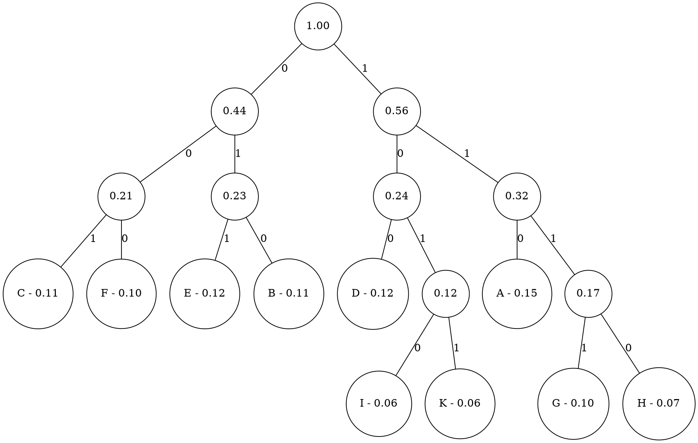

- `A = 0.15`
- `D = 0.12`
- `E = 0.12`
- `B = 0.11`
- `C = 0.11`
- `F = 0.10`
- `G = 0.10`
- `H = 0.07`
- `I = 0.06`
- `K = 0.06`

- `A = 110`
- `B = 010`
- `C = 001`
- `D = 100`
- `E = 011`
- `F = 000`
- `G = 1111`
- `H = 1110`
- `I = 1010`
- `K = 1011`
