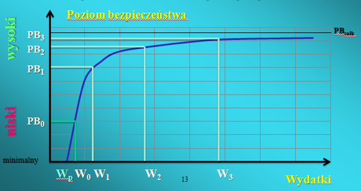

# Bezpieczeństwo systemów komputerowych

## Zadania z egzaminu

### Zadanie 1

Które z poniższych działań zapewniają wiarygodność systemu? Wybierz jedną lub więcej odpowiedzi:

- usuwanie uszkodzeń (fault removal)
- zapobieganie uszkodzeniom (fault prevention, fault avoidance)
- tolerowanie uszkodzeń (fault tolerance)
- prognozowanie uszkodzeń (fault forecasting)
- wymuszanie awarii (fault forcing)

Odpowiedź:

Działania zapewniające wiarygodność systemu to:

- zapobieganie uszkodzeniom (fault prevention, fault avoidance)
- tolerowanie uszkodzeń (fault tolerance)
- usuwanie uszkodzeń (fault removal)
- prognozowanie uszkodzeń (fault forecasting)

### Zadanie 2

Napastnik atakujący system komputerowy najczęściej (wybierz jedną odpowiedź):

- obchodzi zabezpieczenia
- pokonuje słabe zabezpieczenia
- pokonuje średnie zabezpieczenia

Odpowiedź: obchodzi zabezpieczenia

### Zadanie 3

Brak odnotowanych symptomów naruszenia bezpieczeństwa systemu oznacza, że (wybierz jedną odpowiedź):

- bezpieczeństwo systemu na pewno nie zostało naruszone
- posiadamy na 100% sprawny system monitorowania bezpieczeństwa
- bezpieczeństwo systemu mogło zostać naruszone ale możemy o tym nie wiedzieć

Odpowiedź: bezpieczeństwo systemu mogło zostać naruszone ale możemy o tym nie wiedzieć

### Zadanie 4

Które z niżej wymienionych zasobów wymagają ochrony? Wybierz jedną odpowiedź:

- każda informacja uznana za wrażliwą przez jej autora lub dysponenta
- tylko strategiczne dla firmy informacje hnadlowe
- tylko informacje z audytów bezpieczeństwa
- tylko informacje związane ze zdrowiem pracowników
- tylko dane osobowe

Odpowiedź: każda informacja uznana za wrażliwą przez jej autora lub dysponenta

### Zadanie 5

Ustaw etapy analizy ryzyka we właściwej kolejności:

- Określenie ryzyka akceptowalnego i szczątkowego
- Określenie wartości poszczególnych zasobów
- Określenie podatności poszczególnych zasobów
- Pełna identyfikacja oraz inwentaryzacja zasobów
- Określenie skutków naruszenia bezpieczeństwa zasobu
- Identyfikacja zagrożeń dla każdego zasobu

Odpowiedź:

1. Pełna identyfikacja oraz inwentaryzacja zasobów
2. Określenie wartości poszczególnych zasobów
3. Określenie podatności poszczególnych zasobów
4. Identyfikacja zagrożeń dla każdego zasobu
5. Określenie skutków naruszenia bezpieczeństwa zasobu
6. Określenie ryzyka akceptowalnego i szczątkowego

### Zadanie 6

Podczas wdrażania bezpiecznych metod ochrony systemów (wybierz jedną odpowiedź):

- W pierwszej kolejności należy szkolić i uświadamiać kadrę a następnie wdrożyć zabezpieczenia
- W pierwszej kolejności należy wdrożyć zabezpieczenia a następnie szkolić i uświadamiać kadrę
- Wdrażanie zabezpieczeń i szkolenie i uświadamianie kadry powinno odbywać się równolegle

Odpowiedź: Wdrażanie zabezpieczeń i szkolenie i uświadamianie kadry powinno odbywać się równolegle

### Zadanie 7

Podczas wdrażania bezpiecznych metod ochrony systemów (wybierz jedną odpowiedź):

- Proces uświadamiania pracowników musi objąć głównie szeregowych pracowników
- Proces uświadamiania pracowników musi objąć całe przedsiębiorstwo
- Proces uświadamiania pracowników musi objąć głównie prezesa/dyrektora

### Zadanie 8

Podaj definicję **bezpiecznego systemu komputerowego**:

Odpowiedź:

- Bezpieczny system komputerowy to system, którego użytkownik może na nim polegać a zainstalowane oprogramowanie działa zgodnie ze swoją specyfikacją.

- Zgodnie z tą definicją, system możemy uznać za bezpieczny, jeśli można od niego oczekiwać, że wprowadzone na stałe dane nie zostaną utracone, nie ulegną zniekształceniu i nie zostaną pozyskane przez nikogo nieuprawnionego - tym samym ufamy, że system komputerowy będzie przechowywał i chronił te dane.

- Bezpieczeństwo systemu komputerowego jest częścią czegoś co określamy wiarygodnością systemu komputerowego. W takim kontekście wiarygodność (dependability) oznacza pewność działania systemu, która pozwala mieć uzasadnione zaufanie do usług, które ten system dostarcza.

- Bezpieczny system komputerowy to taki system komputerowy, którego użytkownik może na nim polegać, a zainstalowane oprogramowanie działa zgodnie ze swoją specyfikacją. Zgodnie z tą definicją, system możemy uznać za bezpieczny, jeśli można od niego oczekiwać, że wprowadzone na stałe dane nie zostaną utracone, nie ulegną zniekształceniu i nie zostaną pozyskane przez nikogo nieuprawnionego – tym samym ufamy, że system komputerowy będzie przechowywał i chronił te dane.

Bezpieczny system komputerowego jest częścią czegoś co określamy wiarygodnością systemu komputerowego.

### Zadanie 9

- a) Co oznacza następujący atrybut wiarygodności systemu - dostępność (availability)?
- b) Co oznacza następujący atrybut wiarygodności systemu - autentyczność (authenticity)?
- c) Co oznacza następujący atrybut wiarygodności systemu - rozliczalność (accountability)?

Odpowiedź:

System wiarygodny:

- dyspozycyjny (available) = dostępny na bieżąco
- niezawodny (reliable) = odporny na awarie
- bezpieczny (secure) = zapewniający ochronę danych
- bezpieczny (safe) = bezpieczny dla otoczenia, przyjazny dla środowiska
- poufny (confidentiality) – informacja jest dostępna jedynie dla podmiotów do tego upoważnionych;
- spójność/integralność (integrity) – wszelkie nieuprawnione modyfikacje informacji są niedozwolone;
- dostępność (availability) – do informacji można uzyskać dostęp w każdych okolicznościach, które są dopuszczone przez politykę bezpieczeństwa informacji.

Do tej trójki z czasem dołączono także: możliwość rozliczania/rozliczalność (accountability), czyli ustalenia odpowiedzialnych za wykonane operacje.

- Dostępność - Informacja jest dostępna i użyteczna na żądanie uprawnionego podmiotu .
- Niezawodność - jest spójny i zachowanie jest zgonie z zamierzonym i skutki są takie jakie przewidywane.
- Poufność - Informacje są zabezpieczane i udostępnione podmiotom według ich uprawnień.
- Integralność - dane są korpulentne i tworzą całość.
- Rozliczalność - Wiadomo jakie, gdzie i kiedy dany podmiot wykonał działania.

### Zadanie 10

Wymień i krótko opisz minimum cztery najczęściej spotykane zagrożenia dla bezpieczeństwa systemu.

Odpowiedź:

Analiza pochodzenia zagrożenia:

- błąd ludzki - 54%
- bezpieczeństwo fizyczne - 20%
- nieuczciwi pracownicy - 10%
- niezadowoleni pracownicy - 9%
- programy złośliwe - 4%
- ataki zewnętrzne - 3%

Formy ataku elektronicznego:

- podszywanie (masquerading)
- podsłuch (eavesdropping)
- odtwarzanie (replaying)
- manipulacja (tampering)
- wykorzystywanie luk (exploiting, penetration)

Zagrożenia dla bezpieczeństwa systemu:

- włamanie do systemu komputerowego przez osobę nieuprawnioną
- nieuprawnione pozyskanie informacji
- modyfikacja lub zniszczenie danych lub programów komputerowych
- sabotaż (sparaliżowanie pracy) systemu
- bezprawne kopiowanie, rozpowszechnianie lub publikowanie programów komputerowych prawnie chronionych

- Włamanie do systemu komputerowego przez osobę nieuprawnioną
- Nieuprawnione pozyskanie informacji
- Modyfikacja lub zniszczenie danych lub programów komputerowych
- Sabotaż systemu
- Bezprawne kopiowanie, rozpowszechnianie lub publikowanie programów komputerowych prawnie chronionych

Zagrożenia mające wpływ na bezpieczeństwo systemu

- używanie prawnie chronionego programu komputerowego bez upoważnienia
- oszustwo i fałszerstwo związane z wykorzystaniem komputera
- szpiegostwo komputerowe
- używanie komputera bez zezwolenia

### Zadanie 11

Które z poniższych zasad powinna określać Polityka Bezpieczeństwa (w kolejnym pytaniu opisz jedną z nich). Wybierz jedną lub więcej odpowiedzi:

- minimalnych przywilejów
- wiedzy koniecznej
- rozliczalności
- separacji obowiązków
- domniemanej odmowy

Odpowiedź:

- Minimalne przywileje – Przydzielane są tylko takie prawa które są niezbędne do wykonania określonego zadania.
- Wiedza konieczna - Użytkownik sytemu dostaje taki zakres wiedzy o swoich zasobach do których ma prawo dostępu.
- Separacja obowiązków – krytyczne zadnia nie mogą być realizowane przez jedną osobę
- Rozliczalność – zapewnienie jednoznacznej odpowiedzialności
- Domniemanej odmowy – jeśli nie wiadomo czy jest dozwolone to jest zabraniane

### Zadanie 12

- Co to jest podatność (vulnerability)? Podaj definicję.
- Co to jest Incydent Bezpieczeństwa (security incident)? Podaj definicję.
- Co to jest Polityka Bezpieczeństwa (security policy)? Podaj definicję.
- Co to są Zasoby/Aktywa (assets)? Podaj definicję.

Odpowiedź:

Podmiot to byt który jakim sposób dostępu do zasobów co może być użytkownik , grupa urzędników, terminale, komputery, aplikacje, procesy

- Zasób - wszystko to co dla instytucji ma jakąś wartość
- Identyfikacja - rozróżnienie
- Uwierzytelnienie - weryfikacja tożsamości użytkownika
- Autoryzacja – prawa dostępu do zasobów
- Kontrola dostępu – zidentyfikować podmiot i nadzorować prawa dostępu przez ten podmiot
- Podatność - ochrona informacji przed nieautoryzowanym dostępem.
- Integralność – ochrona przed nieautoryzowaną zmianom
- Atletyczność – pewność do pochodzenia danych zasobów
- Niezaprzeczalność – ochrona przed fałszywy zaprzeczeniem
- Prawo dostępu – dopuszczalne sposoby wykorzystania zasobów przez podmiot
- Incydent bezpieczeństwa - niekorzystne zdarzenie związane z bezpieczeństwem informacji, które stwarzają znaczne prawdopodobieństwo zakłócenia działań biznesowych i zagrażają bezpieczeństwu informacji

Polityka Bezpieczeństwa jest to zbiór/zestaw praw, reguł i praktycznych doświadczeń dotyczących sposobu zarządzania, ochrony i dystrybucji danych osobowych wewnątrz określonej organizacji.

Zasób - wszystko to co dla instytucji ma jakąś wartość

Określenie zasobów = "Co chronić?"
Zasoby jakie mogą podlegać ochronie obejmują m.in. (w zależności od typu instytucji, dziedziny działalności itp.):

- sprzęt komputerowy
- infrastruktura sieciowa
- wydruki
- strategiczne dane
- kopie zapasowe
- wersje instalacyjne oprogramowania
- dane osobowe
- dane audytu
- zdrowie pracowników
- prywatność pracowników
- zdolności produkcyjne
- wizerunek publiczny i reputacja

Zasób (obiekt)

- jest jednostką, do której dostęp podlega kontroli
- przykłady: programy, pliki, relacje bazy danych, czy całe bazy danych
- obiekty o wysokiej granulacji: poszczególne elementy bazy danych

### Zadanie 13

Dopasuj opisy podstawowych elementów systemu IDS/IPS. Dopasuj elementy systemu do ich opisów:

1. element analizujący ruch sieciowy i wykrywający ataki
2. element zbierający informacje o atakach z grupy sensorów
3. element umożliwiający wizualizację i analizę logów z grupy sensorów

- sonda
- baza danych
- analizator logów

Odpowiedź:

IDS, IPS - urządzenia sieciowe zwiększające bezpieczeństwo sieci komputerowych przez wykrywanie (IDS) lub wykrywanie i blokowanie ataków (IPS) w czasie rzeczywistym.

Typowe elementy systemu IDS/IPS to:

- sonda (ang sensor) - element analizujący ruch sieciowy i wykrywający ataki
- baza danych - zbierająca informacje o atakach z grupy sensorów
- analizator logów - umożliwiający wizualizację i analizę logów z grupy sensorów

### Zadanie 14

Na podstawie powyższego rysunku omów zależności pomiędzy ponoszonymi wydatkami a poziomem bezpieczeństwa (zaznacz tylko prawdziwe odpowiedzi):

- w systemie o małym poziomie bezpieczeństwa, już niewielkie zwiększenie wydatków (W0 do W1) powoduje znaczny wzrost poziomu bezpieczeństwa (z PB0 do PB1)
- w systemie o bardzo wysokim poziomie bezpieczeństwa, nawet bardzo duże (W2 do W3) zwiększenie wydatków powoduje niewielki wzrost poziomu bezpieczeństwa (z PB2 do PB3)
- minimalny poziom bezpieczeństwa mamy zagwarantowany w każdym systemie
- w systemie o małym poziomie bezpieczeństwa, niewielkie zwiekszenie wydatków (W0 do W1) nie powoduje żadnego wzrostu poziomu bezpieczeństwa (z PB0 do PB1)
- w systemie o bardzo wysokim poziomie bezpieczeństwa, bardzo duże (W2 do W3) zwiekszenie wydatków powoduje wzrost poziomu bezpieczeństwa (z PB2 do PB3) nawet do 100%
- w praktyce nigdy nie osiągniemy maksymalnego (całkowitego) poziomu bezpieczeństwa
- jeśli chcemy osiągnąć tylko minimalny poziom bezpieczeństwa to i tak wymaga to wydatków (WP)

Odpowiedź:

- w systemie o małym poziomie bezpieczeństwa, już niewielkie zwiększenie wydatków (W0 do W1) powoduje znaczny wzrost poziomu bezpieczeństwa (z PB0 do PB1)
- w systemie o bardzo wysokim poziomie bezpieczeństwa, nawet bardzo duże (W2 do W3) zwiększenie wydatków powoduje niewielki wzrost poziomu bezpieczeństwa (z PB2 do PB3)
- w praktyce nigdy nie osiągniemy maksymalnego (całkowitego) poziomu bezpieczeństwa
- jeśli chcemy osiągnąć tylko minimalny poziom bezpieczeństwa to i tak wymaga to wydatków (WP)

### Zadanie 15

Podaj definicję "danych ulotnych".

Zaznacz które z poniższych to dane ulotne. Wybierz jedną lub więcej odpowiedzi:

- otwarte pliki i rejestry
- działające procesy i usługi
- typ i model komputera
- kolor samochodu dwóch ostatnich użytkowników
- pliki SWAP
- aktualna data i czas (zarówno komputera jak i w realnym świecie)
- zawartość RAM
- informacja o komputerach w otoczeniu sieciowym
- informacja o połączeniach sieciowych (np. otwarte porty, adresy)

Odpowiedź:

Dane ulotne – dane zawarte w pamięci działającego urządzenia, które są nieodwracalne tracone w momencie jego wyłączenia.

Przykłady danych ulotnych:

- aktualna data i czas
- zawartość pamięci ulotnej (pamięć RAM i pliki SWAP)
- połączenia sieciowe (otwarte porty TCP lub UDP, NetBIOS, informacja o komputerach znajdujących się w tej samej sieci, pakiety sieciowe),
- zalogowani użytkownicy, konta użytkowników
- zawartość schowka systemowego
- działające procesy i usługi
- zaplanowane zadania
- otwarte pliki i rejestry
- dane z autouzupełnienia (np. z przeglądarek, hasła itp.),
- zrzut ekranu
- skasowane dane

### Zadanie 16

Ustaw fazy ataku elektronicznego we właściwej kolejności.

- propagacja ataku (jeśli przygotowaliśmy opanowany system do dalszych działań)
- skanowanie - szukanie słabości, np. sondowanie usług, badanie portów
- wyznaczenie celu, np. niezabezpieczona usługa, znany exploit (najlepiej podatność 0-day)
- atak na system
- usuwanie śladów (ukrycie ataku i jego skutków)
- modyfikacja systemu (jeśli planujemy np. późniejszy powrót, chcemy zatrzeć ślady)

Odpowiedź:

Fazy ataku elektronicznego:

- skanowanie
- wyznaczenie celu
- atak na system
- modyfikacja systemu
- usuwanie śladów
- propagacja ataku

### Zadanie 17

W kontekście bezpieczeństwa systemu połącz prawidłowo poniższe zdania.

By skutecznie zaatakować, wystarczy znaleźć (wszystkie/żadną/minimum jedną/minimum dwie/tylko przesłanki) słabość.

By skutecznie zavezpieczyć system należy usunąć (wszystkie/żadną/minimum jedną/minimum dwie/tylko przesłanki) słabość.

Odpowiedź:

Problem związany z asymetrią.

- by skutecznie zabezpieczyć system należy usunąć wszystkie słabości
- by skutecznie zaatakować, wystarczy znaleźć jedną słabość
